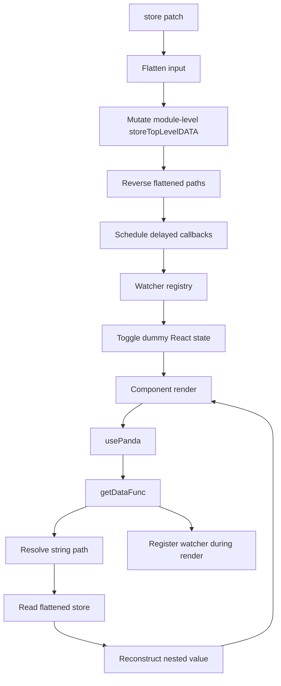
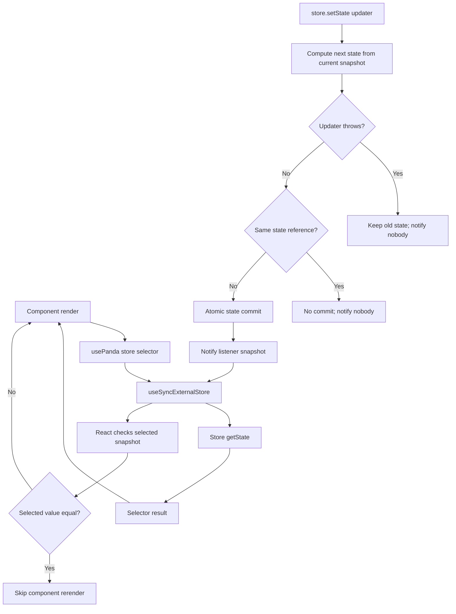

# Panda state manager refactor

## Recommendation

The recommended architecture replaces Panda's global flattened store and render-time watcher registration with an **isolated external store**. The store computes each update against the current snapshot, commits the new state at one point, and then notifies subscribers. React reads the store through `useSyncExternalStore`, which is designed for external state sources and concurrent rendering.[1]

The implementation is in [`panda-store.ts`](./panda-store.ts). It provides:

- `createPandaStore(initialState)` for isolated store instances.
- `setState(...)` for immutable functional or replacement updates.
- `subscribe(...)` with idempotent cleanup.
- `usePanda(store, selector)` for selector-based React subscriptions.
- `usePandaPath(store, path)` for path-oriented access.
- `setAtPath(...)` and `deleteAtPath(...)` for immutable nested updates.

## Current Panda architecture

The current implementation stores state in module-level mutable objects. It flattens nested JSON into string paths, reconstructs values during reads, registers watchers from inside the render phase of `usePanda`, and schedules watcher callbacks through delayed Promises.



This design can work for small client-only applications, but the subscription lifecycle is difficult to make correct. A render can be abandoned after it registers a watcher. Path matching is based on string prefixes. Delayed callbacks can outlive a component, and the module-level store is shared by every React root and server request in the process.

## Recommended architecture

The refactored design uses one canonical state object per store instance. A state update is calculated without modifying the current state. The store commits the new reference only after calculation succeeds. React subscribes through `useSyncExternalStore` and reads a selector from the current snapshot.



## Comparison

| Concern | Current Panda implementation | Recommended implementation | Result |
|---|---|---|---|
| Store ownership | Module-level singleton objects | `createPandaStore` creates an isolated instance | Supports multiple apps, tests, and SSR requests |
| Canonical state | Both nested and flattened representations | One nested state snapshot | Removes synchronization between duplicate representations |
| Update behavior | Mutates `storeTopLevelDATA.current` before reconstruction finishes | Computes first and commits once | Failed updates cannot partially modify live state |
| React subscription | Custom watcher registry plus dummy `useState` | `useSyncExternalStore` | Correct external-store semantics under concurrent React |
| Subscription timing | Watchers are registered during render | React owns subscribe/unsubscribe lifecycle | No abandoned-render subscriptions |
| Selection | String path resolution and reconstruction | Typed selector or path selector | More precise subscriptions and fewer unnecessary renders |
| Equality | Mostly path and flattened-value comparisons | `Object.is` by default, custom equality optional | Clear and configurable rerender behavior |
| Cleanup | Manual watcher IDs and delayed cleanup logic | Idempotent unsubscribe returned by `subscribe` | Less Strict Mode-specific code and fewer leaks |
| Notification | Delayed Promise and timer callbacks | Immediate post-commit listener notification | Predictable ordering and fewer stale callbacks |
| Nested updates | Flatten/reverse processing | Immutable structural copying | Easier reasoning and simpler failure behavior |
| Path safety | Raw string prefix matching | Parsed path segments | Avoids `user` matching `username` and similar collisions |
| SSR behavior | Shared process-level state | Store instance supplied per request | Prevents cross-request state leakage |
| Non-serializable references | Global preservation table with no cleanup | Normal state values or explicit application-owned references | Avoids unbounded retained references |
| TypeScript safety | Many `any` and broad `Function` types | Generic state and selected-value types | Errors are found closer to the call site |

## Example migration

### Existing style

```tsx
const name = usePanda('user.name');

store({
  user: {
    name: 'Ada',
  },
});
```

### Recommended style

```tsx
import {
  createPandaStore,
  usePandaPath,
  setAtPath,
} from './panda-store';

type AppState = {
  user: {
    name: string;
    online: boolean;
  };
};

export const appStore = createPandaStore<AppState>({
  user: {
    name: '',
    online: false,
  },
});

export function UserName() {
  const name = usePandaPath(appStore, ['user', 'name']);
  return <span>{name}</span>;
}

appStore.setState(previous =>
  setAtPath(previous, ['user', 'name'], 'Ada'),
);
```

For components that need a derived value, selectors are preferable to string paths:

```tsx
const displayName = usePanda(
  appStore,
  state => `${state.user.name}${state.user.online ? ' (online)' : ''}`,
);
```

When a selector returns a new object or array, pass a suitable equality function or select primitive fields separately. The hook's selector and equality function should be stable where practical; `useCallback` and `useMemo` are useful for selectors created inside components.

## Important contract

The store cannot prevent a caller from mutating an object held in the current state. Callers must treat state as immutable:

```ts
appStore.setState(previous => ({
  ...previous,
  user: {
    ...previous.user,
    online: true,
  },
}));
```

This is preferable to silently cloning arbitrary values because it makes update cost and ownership explicit. In development, an optional deep-freeze middleware could be added to detect accidental mutations.

## Scope and follow-up work

This refactor intentionally focuses on the store core and React subscription semantics. It does not reproduce every legacy Panda feature, especially wildcard path resolution, dependency interpolation, and arbitrary reference preservation. Those features should be added as explicit, separately tested utilities rather than reintroduced into the subscription mechanism.

The next useful additions would be a development-only mutation detector, middleware for persistence or logging, and tests covering selector equality, nested immutable updates, SSR store isolation, Strict Mode, and rapid consecutive commits.

## References

[1]: https://react.dev/reference/react/useSyncExternalStore "React useSyncExternalStore reference"
